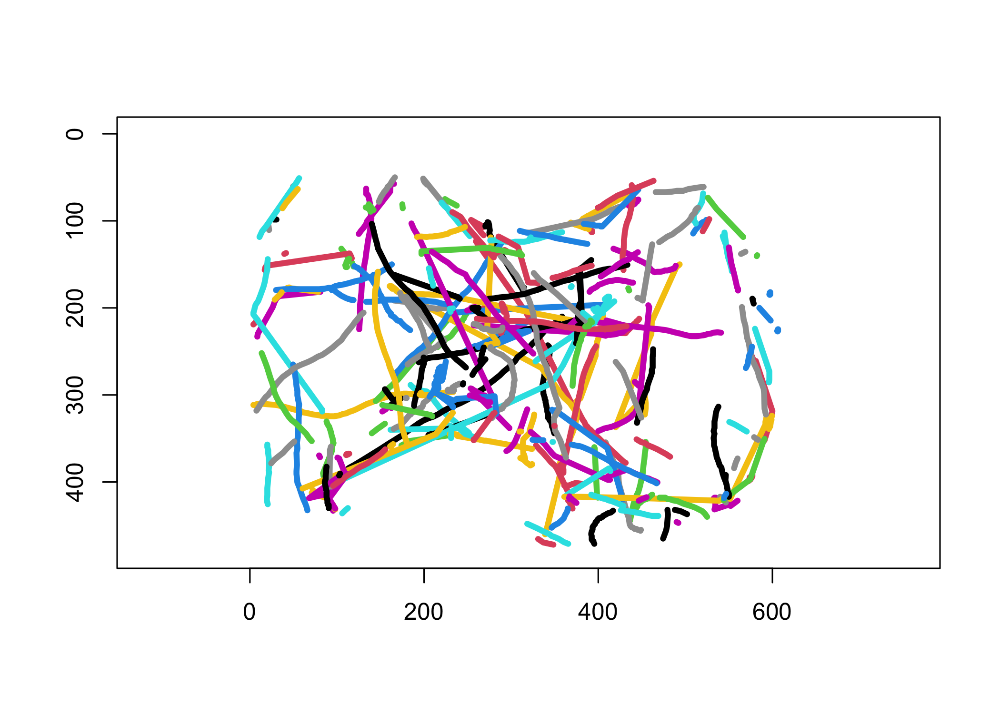
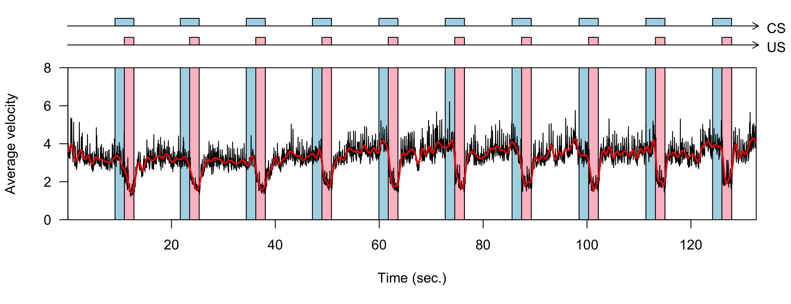
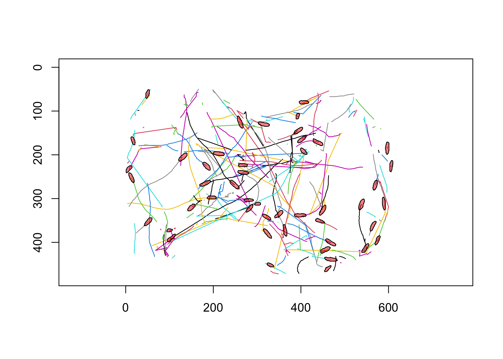
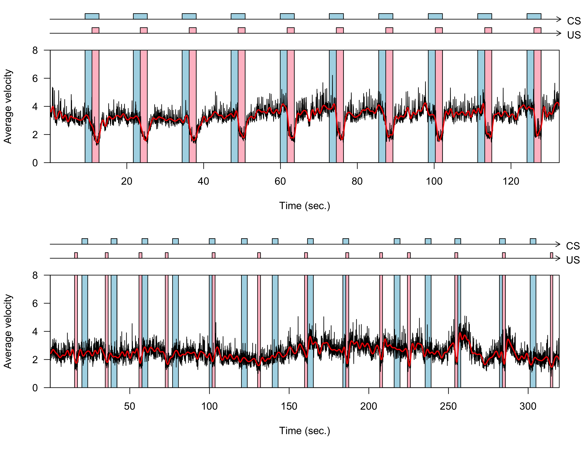

# Paramecium Pavlovian Conditioning <br> Intro to the data
Daniel Fürth & Waked Hamed

- [Overview of the data.](#overview-of-the-data)
- [Load required packages](#load-required-packages)
- [Load the data](#load-the-data)
  - [`.log` files time stamps of
    events](#log-files-time-stamps-of-events)
  - [`_centroid.csv` files with the segmented centroid of each cell per
    frame](#_centroidcsv-files-with-the-segmented-centroid-of-each-cell-per-frame)
  - [`.csv` the DeepSort tracked and assigned bounding
    boxes.](#csv-the-deepsort-tracked-and-assigned-bounding-boxes)
  - [`_shapes.csv` pixel contours of labeled
    cells.](#_shapescsv-pixel-contours-of-labeled-cells)
- [Comparing truly random control with delayed
  conditioning.](#comparing-truly-random-control-with-delayed-conditioning)
  - [Load the truly random control](#load-the-truly-random-control)
  - [Load the delayed conditioning](#load-the-delayed-conditioning)
  - [Plot both](#plot-both)

## Overview of the data.

✅ indicate data that have been processed and deposited into the
`./data/` folder.

| Experiment                      | Arduino file                                                                     | Raw video                           | Processed data               | Avg. cells/frame | Note |                   |
|---------------------------------|----------------------------------------------------------------------------------|-------------------------------------|------------------------------|------------------|------|-------------------|
| 15 Volt, fixed ITI, 10 trials   | [Experiment1.ino](https://github.com/Wakedd/Arduino/blob/main/Experiment1.ino)   | 2023-07-11_19-59-01-15V.avi         | ✅ 15000mVSample00            | 27.04            |      |                   |
|                                 | [Experiment1.ino](https://github.com/Wakedd/Arduino/blob/main/Experiment1.ino)   | 2023-07-11_19-34-07-15V(1).avi      | ✅ 15000mVSample01            | 23.72            |      |                   |
|                                 | [Experiment1.ino](https://github.com/Wakedd/Arduino/blob/main/Experiment1.ino)   | 2023-07-11_19-44-56-15V(2).avi      | 🛑 15000mVSample02           | 17.54            |  Recording halt midway    |                   |
|                                 | [Experiment1.ino](https://github.com/Wakedd/Arduino/blob/main/Experiment1.ino)   | 2023-07-11_19-51-52-15V(3).avi      | ✅ 15000mVSample03            | 48.68            |      |                   |
| 10.2 Volt, fixed ITI, 10 trials | [Experiment1.ino](https://github.com/Wakedd/Arduino/blob/main/Experiment1.ino)   | 2023-07-11_23-01-55_10,2V.avi       | 🛑 10200mVSample00            |                  |      |                   |
|                                 | [Experiment1.ino](https://github.com/Wakedd/Arduino/blob/main/Experiment1.ino)   | 2023-07-11_23-51-49_10,2V(1).avi    | 🛑 10200mVSample01            |                  |      |                   |
|                                 | [Experiment1.ino](https://github.com/Wakedd/Arduino/blob/main/Experiment1.ino)   | 2023-07-12_00-00-22_10,2V(2).avi    | 🛑 10200mVSample02            |                  |      |                   |
|                                 | [Experiment1.ino](https://github.com/Wakedd/Arduino/blob/main/Experiment1.ino)   | 2023-07-11_23-01-55_10,2V(3).avi    | 🛑 10200mVSample03            |                  |      |                   |
| 4.7 Volt, fixed ITI, 10 trials  | [Experiment1.ino](https://github.com/Wakedd/Arduino/blob/main/Experiment1.ino)   | 2023-08-10_4,7.avi                  | ✅ 4700mVSample00             |                  |      |                   |
|                                 | [Experiment1.ino](https://github.com/Wakedd/Arduino/blob/main/Experiment1.ino)   | 2023-08-11_4,7(1).avi               | ✅ 4700mVSample00             |                  |      |                   |
|                                 | [Experiment1.ino](https://github.com/Wakedd/Arduino/blob/main/Experiment1.ino)   | 2023-08-12_00-44-40_4,7(2).avi      | ✅ 4700mVSample00             |                  |      |                   |
|                                 | [Experiment1.ino](https://github.com/Wakedd/Arduino/blob/main/Experiment1.ino)   | 2023-08-12_00-50-25_4,7(3).avi      | ✅ 4700mVSample00             |                  |      |                   |
| 2.2 Volt, fixed ITI, 10 trials  | [Experiment1.ino](https://github.com/Wakedd/Arduino/blob/main/Experiment1.ino)   | 2023-07-10_2,2.avi                  | ✅ 2200mVSample00             |                  |      |                   |
|                                 | [Experiment1.ino](https://github.com/Wakedd/Arduino/blob/main/Experiment1.ino)   | 2023-07-11_2,2(1).avi               | 🛑 2200mVSample01             |                  |      |                   |
|                                 | [Experiment1.ino](https://github.com/Wakedd/Arduino/blob/main/Experiment1.ino)   | 2023-07-11_2,2(2).avi               | 🛑 2200mVSample02             |                  |      |                   |
|                                 | [Experiment1.ino](https://github.com/Wakedd/Arduino/blob/main/Experiment1.ino)   | 2023-07-17_19-21-27_2,2(3).avi      | 🛑 2200mVSample03             |                  |      |                   |
| 1.0 Volt, fixed ITI, 10 trials  | [Experiment1.ino](https://github.com/Wakedd/Arduino/blob/main/Experiment1.ino)   | 2023-07-19_02-08-55_exp3cond.avi    | ✅ 1000mVSample00             |                  |      |                   |
|                                 | [Experiment1.ino](https://github.com/Wakedd/Arduino/blob/main/Experiment1.ino)   | 2023-07-19_05-44-46-exp3cond(1).avi | ✅ 1000mVSample00             |                  |      |                   |
|                                 | [Experiment1.ino](https://github.com/Wakedd/Arduino/blob/main/Experiment1.ino)   | 2023-07-23_07-20-56_exp3cond(2).avi | ✅ 1000mVSample00             |                  |      |                   |
|                                 | [Experiment1.ino](https://github.com/Wakedd/Arduino/blob/main/Experiment1.ino)   | 2023-07-23_10-43-53_exp3cond(3).avi | ✅ 1000mVSample00             |                  |      |                   |
| Truly random control            | [Exp3a.ino](https://github.com/Wakedd/Arduino/blob/main/Exp3a.ino)               | 2023-07-19_07-35-47_trulyR.avi      | 🛑 TrulyRandomControlSample00 |                  |      | Error in log file |
|                                 | [Exp3a.ino](https://github.com/Wakedd/Arduino/blob/main/Exp3a.ino)               | 2023-07-19_07-17-40_trulyR(0).avi   | ✅ TrulyRandomControlSample01 |                  |      |                   |
|                                 | [Exp3a.ino](https://github.com/Wakedd/Arduino/blob/main/Exp3a.ino)               | 2023-07-23_03-57-44.\_trulyR(1).avi | 🛑 TrulyRandomControlSample02 |                  |      |                   |
|                                 | [Exp3a.ino](https://github.com/Wakedd/Arduino/blob/main/Exp3a.ino)               | 2023-07-23_04-05-12_trulyR(2).avi   | ✅ TrulyRandomControlSample03 | 45.61            |      |                   |
| Random ITI, 30 trials           | [Exp3_control.ino](https://github.com/Wakedd/Arduino/blob/main/Exp3_control.ino) | 2023-07-19_02-08-55_exp3cond.avi    | ✅ RandomSample00             |                  |      |                   |
|                                 | [Exp3_control.ino](https://github.com/Wakedd/Arduino/blob/main/Exp3_control.ino) | 2023-07-19_05-44-46-exp3cond(1).avi | ✅ RandomSample01             |                  |      |                   |
|                                 | [Exp3_control.ino](https://github.com/Wakedd/Arduino/blob/main/Exp3_control.ino) | 2023-07-23_07-20-56_exp3cond(2).avi | ✅ RandomSample02             |                  |      |                   |
|                                 | [Exp3_control.ino](https://github.com/Wakedd/Arduino/blob/main/Exp3_control.ino) | 2023-07-23_10-43-53_exp3cond(3).avi | ✅ RandomSample03             |                  |      |                   |

## Load required packages

I aim to minimize package dependencies in my R projects, relying solely
on base R. Nevertheless, I employ a point-in-polygon test, necessitating
compiled C code for speed. For this purpose, I leverage the
point-in-polygon command from the `sp` package:

``` r
if(!require('sp')){
  install.packages('sp')
}
```

    Loading required package: sp

``` r
library(sp)
```

Currently I have some helper functions to load, organize, clean and make
some basic visualizations. These are all made in base R and contained in
the folder `./r/`. As the project develops and when there is more need
to call C/C++ directly and classes can be more well-defined I will
probably make this into a standalone package.

``` r
files<-dir('r', full.names = TRUE)
helpfunc <- lapply(files, source)
```

## Load the data

### `.log` files time stamps of events

We begin by loading a `.log` file. These files are synchronized output
between the Raspberry Pi OpenCV video recording and the Arduino that
controls the conditioning protocol:

``` r
files <- dir('data', full.names = TRUE)
file <- files[basename(files) == '15000mVSample03.log']
log <- read.log(file)
head(log)
```

      frame  time stimulus event trial
    1     2 10354    start     0    NA
    2   274 20355       CS    on     0
    3   328 22355       US    on     0
    4   383 24355       CS   off     0
    5   383 24355       US   off     0
    6   651 34356       CS    on     1

The variables are:

- `log$frame` integer, is the exact video frame (0-indexed). 30 fps.
- `log$time` integer, is the hardware clock on the Arduino in
  milliseconds since the Arduino was rebooted. It can give you an
  estimate for how long the cells have been in the well before the start
  of the experiment.
- `log$stimulus` character, name of the stimulus (e.g. `CS`, `US`, and
  protocol `start`)
- `log$event` character, if stimulus event is `on` or `off`.
- `log$trial` integer, the current conditioning trial (0-indexed).

### `_centroid.csv` files with the segmented centroid of each cell per frame

The centroid is extracted by segmentation with a [U-net/ResNet
(StarDist)](https://github.com/furthlab/paramecium_behavior/tree/main/models/grayscale_paramecium).
OpenCV is then used to extract the centroid coordinate (x,y) of each
label for each frame.

``` r
file <- 'data/15000mVSample03_centroid.csv'
cent <- read.centroid(file)
head(cent)
```

      frame ID   x   y
    1     0  0 428 467
    2     0  1 329 471
    3     0  2 414 434
    4     0  3 543 428
    5     0  4  86 408
    6     0  5 431 406

- `cent$frame` integer, the exact video frame (0-indexed). 30 fps.
- `cent$ID` integer, unique label id for each frame. Note that ID does
  not track the cell identity over time it is based on the pixel
  coordinate while segmenting the label on each frame.  
- `cent$x` integer, pixel coordinate in x (0 is bottom left corner).  
- `cent$y` integer, pixel coordinate in y (0 is top left corner).

### `.csv` the DeepSort tracked and assigned bounding boxes.

Load the data.

``` r
dat <- read.table(files[basename(files) == '15000mVSample03.csv'], sep=',', header=TRUE)
```

Here `clean.bb()` is a command that removes bounding boxes where the
cells have been lost. It does so by checking for the presence of a
segmented centroid inside the bounding box and then flagging a variable
`remove` with `TRUE`. We can then subset this data into dat3.

``` r
dat2 <- clean.bb(dat, cent)
dat3 <- dat2[!dat2$remove,]
```

Lets plot the trajectories for the second to the fourth second (fps =
30), so frame 30 to 90:

``` r
plot.tracks(dat3[dat3$frame %in% c(30:90),])
```



Lets calculate the velocity:

``` r
vel <- get.velocity(dat3)
par(mfrow=c(1,2))
hist(vel$velocity, breaks=100, main='velocity')
hist(log10(vel$velocity), breaks=100, main='log10')
```


``` r
vec <- tapply(vel$velocity, vel$frame, mean, na.rm=TRUE)

par(mfrow=c(1,2))
hist(vec, breaks=100, main='Average velocity')
hist(log10(vec), breaks=100, main='log10')
```


Lastly lets superimpose the `.log` file onto the calculated velocity
data.

``` r
plot.velocity(vel, log)
```



### `_shapes.csv` pixel contours of labeled cells.

The largest files are the `_shapes.csv` which contains the pixel
outlines of each segmented cell (hence the morphology). The contour has
been obtained through OpenCV via
[cv::findContours](https://docs.opencv.org/3.4/df/d0d/tutorial_find_contours.html).

``` r
file <- files[basename(files) == '15000mVSample03_shapes.csv']
shape <- read.shapes(file)
head(shape)
```

      frame ID   x   y
    1     0  0 432 462
    2     0  0 431 463
    3     0  0 428 463
    4     0  0 427 464
    5     0  0 425 464
    6     0  0 424 465

``` r
nrow(shape)
```

    [1] 5135425

Here we have a data set with 5,135,425 rows and 193,603 different
contours.

Lets plot the shapes from frame 90 and superimpose them onto the tracks
obtained from the DeepSort `15000mVSample03.csv` file.

``` r
plot.tracks(dat3[dat3$frame %in% c(30:90),], lwd = 1)

plot.shapes(shape[shape$frame==90,], plot = FALSE, col = rgb(1,0,0,0.5))
```



## Comparing truly random control with delayed conditioning.

Now that we have the basics down we can load two datasets and compare
them visually.

### Load the truly random control

``` r
files <- dir('data', full.names = TRUE)

#load log file with timestamps
file <- files[basename(files) == 'TrulyRandomControlSample03.log']
logTRC <- read.log(file)

#load centroids and bounding boxes
file <- files[basename(files) == 'TrulyRandomControlSample03_centroid.csv']
centTRC <- read.centroid(file)
file <- files[basename(files) == 'TrulyRandomControlSample03.csv']
datTRC <- read.table(file, sep=',', header=TRUE)
```

### Load the delayed conditioning

``` r
files <- dir('data', full.names = TRUE)

#load log file with timestamps
file <- files[basename(files) == '15000mVSample03.log']
log <- read.log(file)

#load centroids and bounding boxes
file <- files[basename(files) == '15000mVSample03_centroid.csv']
cent <- read.centroid(file)
file <- files[basename(files) == '15000mVSample03.csv']
dat <- read.table(file, sep=',', header=TRUE)
```

### Plot both

We begin by cleaning up and computing velocities for both

``` r
dat <- clean.bb(dat, cent)
dat <- dat[!dat$remove,]

datTRC <- clean.bb(datTRC, centTRC)
datTRC <- datTRC[!datTRC$remove,]

vel <- get.velocity(dat)
velTRC <- get.velocity(datTRC)
```

Then plotting:

``` r
par(mfrow=c(2,1))
plot.velocity(vel, log)
plot.velocity(velTRC, logTRC)
```


